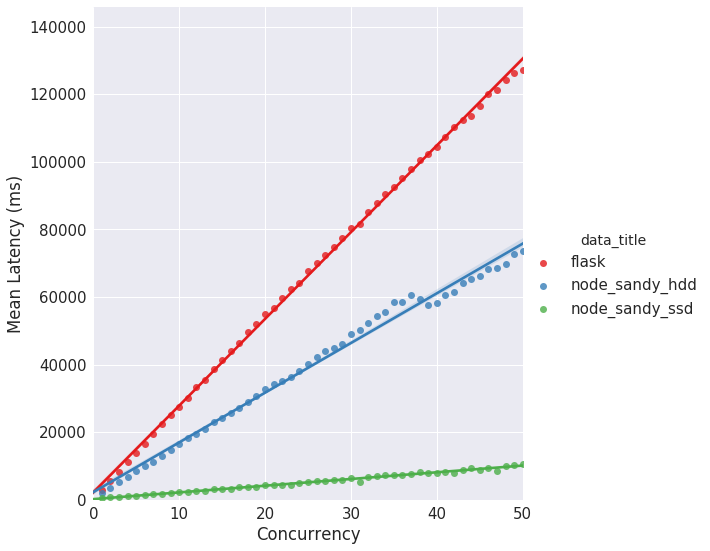

[](http://www.wtfpl.net/)

# loadtest-plotter
Plot results produced by the npm module 'loadtest'.

A common task in server stress testing is to compare the server's performance by varying some paramater of requests, *concurrency* being the major one. Npm's [loadtest](https://www.npmjs.com/package/loadtest) module can run a load test on the selected HTTP or WebSockets URL. It provides control over different parameters including concurrency, total number of requests, etc.

This project takes results produced by individual *loadtest* tests and creates beautiful graphs which help in analysing server performance.

loadtest-plotter utilises python's seaborn library to make visually pleasing and informative plots.

### Example Graphs
Example graph of one of the output parameters (Mean Latency) is shown here:


## Usage

### Dependencies
These tools need to be installed before loadtest-plotter can be used.
- loadtest
- jupyter
- sysstat (for CPU usage stats)

### loadtest
Use the utility script to gather loadtest data. The script's required parameters are described in its usage string:
```
./loadtest_runner.sh -h
```

An example run of the script is:
```
./loadtest_runner.sh -a http://172.31.107.121:3500/ping -c 50 -m GET -n 500
```

### Make Graphs
Start the jupyter notebook and run all cells after tweaking values according to your loadtest results.
```
jupyter notebook
```

